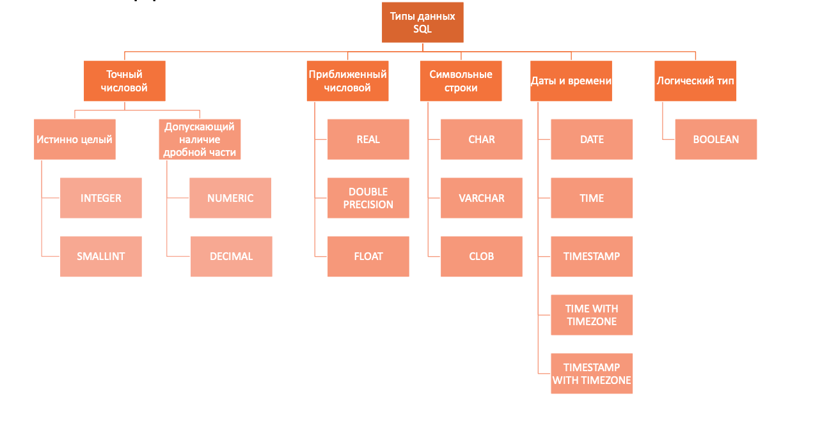

## Тема 1. Базовые SQL-запросы

### Теоретическая справка

#### 1.0 Введение

**Операторы SQL:**


**Типы данных SQL:**


#### 1.1 Структура запроса

Порядок написания запроса:

```sql
SELECT [DISTINCT] select_item_comma_list -- список столбцов для вывода
FROM table_reference_comma_list -- список таблиц
[WHERE conditional_expression] -- условия фильтрации, можно использовать AND / OR / NOT
[GROUP BY column_name_comma_list] -- условие группировки
[HAVING conditional_expression] -- условие фильтрации после группировки
[ORDER BY order_item_comma_list]; -- список полей, по которым сортируется вывод
```

#### 1.2 Порядок выполнения запроса

Порядок выполнения запроса отличается от порядка его записи, это необходимо помнить:

**FROM <span>&#8594;</span> WHERE <span>&#8594;</span> GROUP BY <span>&#8594;</span> HAVING <span>&#8594;</span> SELECT <span>&#8594;</span> ORDER BY**

####  1.3 Агрегирующие функции
					
При группировке в блоке `SELECT` могут встречаться либо атрибуты, по которым происходит группировка, либо атрибуты, которые подаются на вход агрегирующим функциям. В SQL есть 5 стандартных агрегирующих функций. При выполнении запроса функции не учитывается специальное значение `NULL`, которым обозначается отсутствующее значение.
					
* `count()` – количество записей с известным значением. Если необходимо подсчитать количество уникальных значений, можно использовать `count(DISTINCT field_nm)`
* `max()` - наибольшее из всех выбранных значений поля
* `min()` - наименьшее из всех выбранных значений поля
* `sum()` - сумма всех выбранных значений поля
* `avg()` - среднее всех выбранных значений поля
					 					
#### 1.5 Полезные функции

Иногда бывает полезно использовать в запросе специальные функции:
* `IN` - принадлежность определенному набору значений:
`X IN (a1, a2, ..., an)` <span>&#8803;</span> X = a<sub>1</sub> or X = a<sub>2</sub> or ... or X = a<sub>n</sub>
* `BETWEEN` - принадлежность определенному интервалу значений:
`X BETWEEN A AND B` <span>&#8803;</span> (X >= A and X <= B) or (X <= A and X >= B)
* `LIKE` - удовлетворение текста паттерну: `X LIKE '0%abc_0'`, где `_` - ровно 1 символ, а `%` - любая последовательность символов (в том числе нулевой длины).
* `IF ... THEN ... [ELSIF ... THEN ... ELSE ...] END IF` - ветвления, **пример**:
```postgresql
SELECT
    IF number = 0 THEN
        'zero'
    ELSIF number > 0 THEN
        'positive'
    ELSIF number < 0 THEN
        'negative'
    ELSE
        'NULL'
    END IF AS number_class
FROM
    numbers
```
* `CASE [...] WHEN ... THEN ... ELSE ... END CASE` - еще один аналог ветвлений, **пример**:
```postgresql
SELECT
    CASE 
        WHEN number = 0 THEN
            'zero'
        WHEN number > 0 THEN
            'positive'
        WHEN number < 0 THEN
            'negative'
        ELSE
            'NULL'
    END CASE AS number_class
FROM
    numbers
```
* `DISTINCT ON` - исключает строки, совпадающие по всем указанным выражениям, **пример**:
```postgresql
-- вывести кол-во уникальных отделов
SELECT
    count(DISTINCT ON department_nm)
FROM
    salary;
```
* [Еще немного полезностей](https://postgrespro.ru/docs/postgresql/9.5/functions-conditional)


### 2. Практическое задание

-- 1. Создать схему sem_1:

--2. Создать таблицу sem_1.movies с полями
-- title (название фильма)
-- release_year (год выпуска)
-- duration_min (длительность в мин)
-- genre (жанры)
-- rating (рейтинг)
-- director (режиссёр)
-- star_1 (1й главный актёр)
-- star_2 (2й главный актёр)

-- И запустить операции вставки (из отдельного файла)

--3. Посмотреть метаданные о таблице и столбцах в information_schema.tables и information_schema.columns

--4. Выведи всё содержимое таблицы


--5. Выведи все названия фильмов и их год выпуска


--6. Выведите всех режиссёров, встречающихся в таблице


--7. В каком году был снят 'Fight Club'? Вывести только год


--8. Выведите все фильмы 'Christopher Nolan', год и рейтинг


--9. Выведите все фильмы, в которых главную роль сыграл 'Christian Bale'


--10. Найдите все комедии (Comedy) длительностью меньше 2х часов и с рейтингом не менее 8.5
-- Выводить название фильма, год, длительность, жанр, рейтинг


--11. Выведите все фильмы, снятые до 2010 года, в которых снимался 'Leonardo DiCaprio' или 'Tom Hanks'.
-- Выводить название фильма, год, двух главных героев


--12. Выведите все фильмы жанра 'Drama'
-- Учитывайте, как лежат данные в столбце genre


--13. Выведите всех актёров, которых зовут Jack, Sam или John (можно только для star_1).


--14. Выведите все названия фильмов, в которых содержится либо цифра 3, либо цифра 7.


--15. Найдите кол-во фильмов, кол-во различных режиссёров, самый ранний и поздний год релиза


--16. Выведите для каждого режиссёра кол-во его фильмов. Упорядочить по убыванию кол-ва фильмов


--17. Сколько часов займёт просмотр всех фильмов 'Quentin Tarantino'?


-- 18. Выведите всех актёров, которые были 1-м главным актёром в более чем 3х фильмах,
-- и кол-во таких фильмов соответственно


--19. Найдите всех режиссёров 21го века (первый фильм был снят после 2000го года). Вывести режиссёра и год первого фильма


--20. Выведите фильм с самым большим рейтингом

--21. Выведите для каждого режиссёра его самый ранний фильм (при равенстве годов выводить с наибольшим рейтингом)
-- Вывести стобцы режиссёр, название фильма, год, рейтинг


--22. Найдите кол-во и средний рейтинг фильмов для двух категорий: фильмы 20го и 21го века
-- Округлить до двух знаков после запятой


--Работа с датами

--23. Создадим таблицу с операциями:

DROP TABLE IF EXISTS sem_1.operations;
CREATE TABLE sem_1.operations (
    operation_id SERIAL,
    operation_dt DATE,
    client_rk INTEGER,
    operation_amt INTEGER
);

INSERT INTO sem_1.operations (operation_dt, client_rk, operation_amt) VALUES
    ('2023-12-01', 1, 1000),
    ('2024-01-01', 2, 100),
    ('2024-01-05', 1, 10),
    ('2024-01-07', 5, 50),
    ('2024-01-15', 7, 500),
    ('2024-01-21', 3, 5000),
    ('2024-01-31', 9, 500),
    ('2024-02-01', 4, 500);
;

-- 24. Как найти для каждого клиента сумму операций за последний месяц? (если сегодня 2 февраля, то операции считаем со 2го января)

-- 25. Как найти для каждого клиента среднюю сумму операций за текущий месяц (если сегодня 2 февраля, то только за февраль)?

--26. Найдите сумму платежей в каждом квартале

---

### Полезные ссылки
* [SQLize.online is a free online SQL environment for quickly running, experimenting with and sharing SQL code.](https://sqlize.online/sql/psql14/9cffb8e3d397e93627eb41cd55b10c20/)
